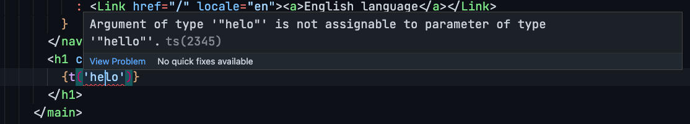

<div align="center">
  

## next-g11n 🌐

Your toolbelt for translating Next.js apps


</div>

🪡 tailor-made for [Next.js i18n Routing](https://nextjs.org/docs/advanced-features/i18n-routing)

👮 Type-safe dictionaries

☁️ optimized for Server-Side Rendering

<div align="center">
  
</div>

## Getting started 🏗

1. Install the dependency
   `yarn add next-g11n` or `npm i next-g11n`

2. Create your `dictionary.ts` (or any other name, actually)

| type     | default |
| -------- | ------- |
| `object` | -       |

The translation object/map. It can either carry one locale, or all. The object format is as follows:

```ts
{
  'locale-key': {
    'translation-key': 'value - number or string'
  }
}
```

<details>
  <summary>Copy/paste example</summary>

```ts
// example dictionary.ts
const dictionary = {
  // top level are locales (de) or (de-at), for example
  en: {
    // these are the translation keys
    hello: 'Hi',
  },
  'de-de': {
    hello: 'Hallo',
  },
  'de-at': {
    hello: 'Grüß Gott',
  },
}
```

</details>

3. Choose between Client-Side-only or Server-Side translations

## Helper methods 🧠

### getLocale

Receives a `router` instance from Next.js `useRouter` and returns the current locale if supported by your app, or the `defaultLocale`.

```tsx
const router = useRouter()
const g11nLocale = getLocale(router) as Locales
```

## Client-side only 🪝

When you call your hook, establish the types for the dictionary

```tsx
import type { NextPage } from 'next'
import { useG11n } from 'next-g11n'
import { DICTIONARY } from '../dictionary'

const Home: NextPage = () => {
  const { translate: t } = useG11n<typeof DICTIONARY>(DICTIONARY)

  return (
    <h1>{t('hello')}</h1>
  )
}

```

> ⚠️ this strategy will bring in the entire Dictionary to your bundle

### useFallback

When `true`, if the translation does not exist in dictionary, the `key` will show. When set to false, it will throw an error.

| type      | default |
| --------- | ------- |
| `boolean` | `false` |

† recomended for apps without TypeScript

## Server-Side Rendering 🌤

### Static Translations

Translations which do not require interpolation, can be completely rendered on the Server-Side within `getStaticProps`. An object with all translated terms will be injected in your page `props`.

```tsx
const Home = ({ hello }: InferGetStaticPropsType<typeof getStaticProps>) => {
  const router = useRouter()
  const g11nLocale = getLocale(router) as Locales

  return <h1 className={styles.title}>{hello[g11nLocale]}</h1>
}

export const getStaticProps = async () => {
  const hello = createStaticTerm<Keys, Locales>('hello', DICTIONARY)

  return {
    props: {
      hello,
    },
  }
}
```

### Interpolated Terms

To interpolate terms there are 2 methods required. On the server-side it’s required to map all possible **translation terms** (still with template variables) by locale with `createFunctionTerm`. That `object` can then be passed down to each page `props`. Once arriving on the client-side, it’s required to use `clientSideTranslate` to map each **translation term** to its method to interpolate the term with each variable and assign the proper types.

<details>
  <summary>Why 2 methods?</summary>

Functions are not serializable out-of-the-box in JavaScript, and `getStaticProps` only passes down serialized object as its returned `props`. It is possible to call both methods on the server if you handle serializing the output functions. But then again, it will be required to deserializing them on the client-side.

</details>

#### createFunctionTerm (server-side)

This method will receive a translation key, and the whole dictionary. It will output a _raw_ translation term (with uninterpolated variables). This is an object literal ready to be serialized by `getStaticProps` on its way to the client-side.

```tsx
const rawTerm = createFunctionTerm('term', DICTIONARY)
```

#### clientSideTranslate (client-side)

Once on the client-side, this method will receive the _raw term_ from `createFunctionTerm` and ouput one method for each supported locale. This method is a **TypeScript generic**, first parameter is your `Locales` exported from your whole dictionary, and the second is a `string union` with each available parameter for that translation term.

```tsx
export type Locales = keyof typeof DICTIONARY

const Page = ({ rawTerm }: InferGetStaticPropsType<typeof getStaticProps>) => {
  const router = useRouter()
  const g11nLocale = getLocale(router) as Locales
  const term = clientSideTranslate<Locales, 'var1' | 'var2'>(rawTerm)

  return <h1>{term[g11nLocale]({ var1: 'foo', var2: 'bar' })}</h1>
}
```

## Examples 🍱

| directory                                                  | description                                 |
| ---------------------------------------------------------- | ------------------------------------------- |
| [client-side](tree/main/example/client-side)               | minimal setup for Client-side translations  |
| [server-side-render](tree/main/example/server-side-render) | minimal setup for SSR-friendly translations |

## Additional info ❓

- Support starts with Next.js i18n Routing, so `v10+`
- Next.js is a `peerDependency`
- React is a `peerDependency`

## Glossary 📖

| abbreviation | full word            | meaning                                              |
| ------------ | -------------------- | ---------------------------------------------------- |
| i18n         | internationalization | enable adaptation of a product to multiple languages |
| L10n         | localization         | translating and customizing to a specific place      |
| g11n         | globalization        | addressing requirements to launch globally           |
